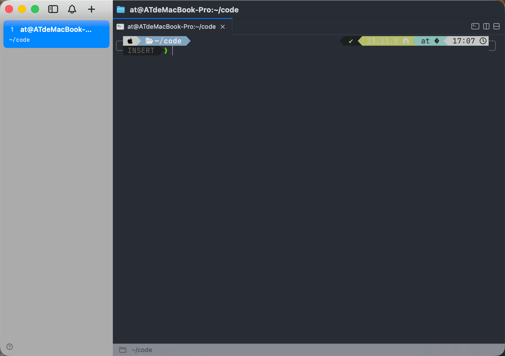

# jmux

一个基于 [Ghostty](https://ghostty.org) 的原生 macOS 终端，提供垂直标签页和通知面板。

<p align="center">
  
</p>

## 功能特性

- **垂直标签页** —— 适合放长标题和几十个会话，不用横向滚动。
- **通知面板** —— 每个 pane 的底部状态栏会显示命令完成提示、OSC 9/4 进度，以及渲染器健康状态。
- **Ghostty 内核** —— 同样的 GPU 加速渲染，同一份 `~/.config/ghostty/config` 直接复用。
- **多工作区 + 分屏** —— 基于 Bonsplit 的拖拽分屏、侧边栏工作区，关闭标签页支持撤销。
- **无损远程会话** —— `jmux ssh <host>` 会自动部署远端 daemon，端口转发干净，远端工作区一键启动。
- **Agent skills** —— `jmux skills install` 会把内置 skill 安装到 Claude Code (`~/.claude/skills/`) 和 Codex (`$CODEX_HOME/skills/`)。
- **快捷键自定义 + 多语言** —— jmux 自带的每一个快捷键都能在「设置」里改；界面已本地化（目前支持英文和日文）。
- **Sparkle 自动更新** —— 详见下方[自动更新](#自动更新)。

## 下载

最新版本：<https://github.com/Sean529/jmux-releases/releases/latest>

从 Assets 里下载 `jmux-v<版本号>.zip`，解压后把 `jmux.app` 拖到 `/Applications`。

### 首次启动（Gatekeeper）

构建采用 ad-hoc 签名，首次启动会被 macOS Gatekeeper 拦下。任选其一：

- 右键 `jmux.app` → **打开** → 在弹窗里确认；或者
- 用命令去掉一次隔离属性：
  ```bash
  xattr -dr com.apple.quarantine /Applications/jmux.app
  ```

发布构建只包含 arm64（Apple Silicon）。Intel Mac 用户需要自己从源码构建，加上 `ARCHS='arm64 x86_64' ONLY_ACTIVE_ARCH=NO`。

## 自动更新

jmux 内置了 [Sparkle](https://sparkle-project.org)，会自动查询本仓库的更新：

- Appcast 地址：`https://github.com/Sean529/jmux-releases/releases/latest/download/appcast.xml`
- 应用会在安装每个更新前校验 `ed25519` 签名，被篡改的 appcast 会直接被拒。

装好之后你就不用再回到这个页面看了——jmux 每次启动会自己检查更新，有新版本会弹提示。

## 许可证

详见 [LICENSE](./LICENSE)。

## 源代码

源代码仓库是私有的。本仓库只托管发布产物（`.zip` + `appcast.xml`），供 Sparkle 拉取使用。
